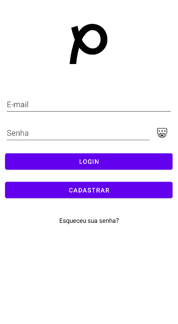
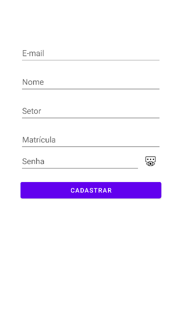
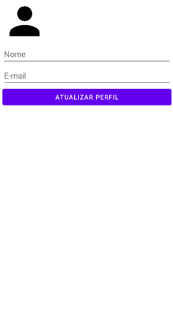

# Mobile-Android
Protótipo de app com splash screen, tela de login, cadastro, reset de senha e com conexão com Firebase

Abaixo temos a Splash Screen do app, que é uma tela de início que roda antes do app abrir na tela de login ou principal

Aqui temos a Tela de login e autenticação do usuário

Aqui é a Tela de Cadastro do usuário

E aqui é a tela de recuperação de senha

Tela de atualização de foto de dados cadastrais (Nome, e-mail e foto de perfil)

